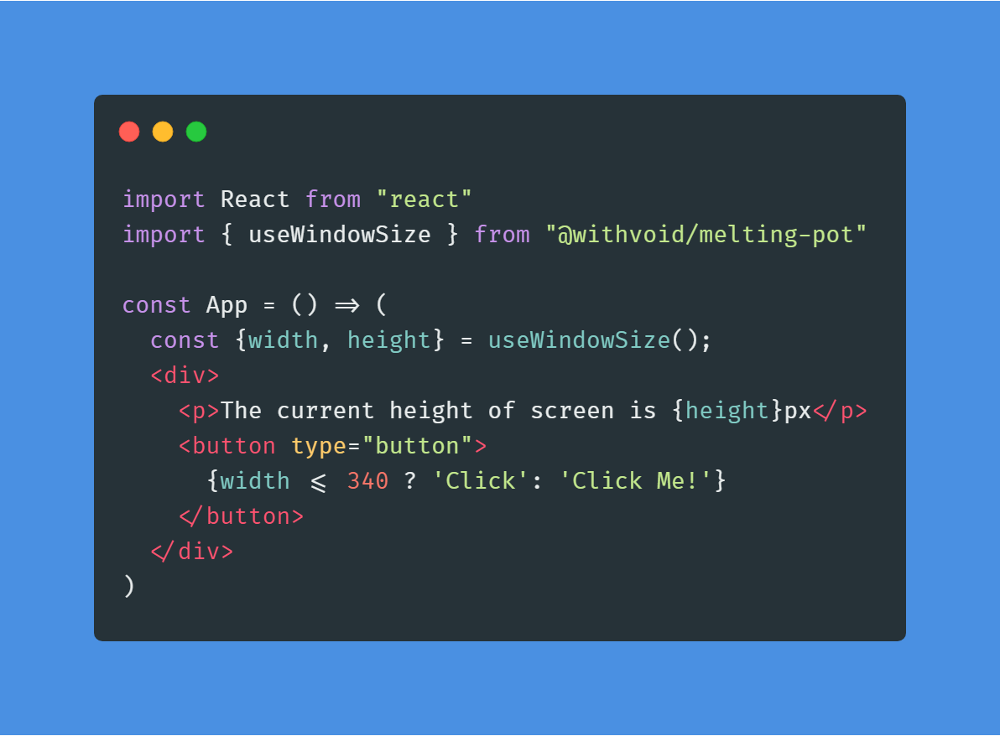

## Melting Pot

<p align="center">
  
  
  
  <a href="https://packagephobia.now.sh/result?p=@withvoid/melting-pot@latest">
    
  </a>
</p>

The `@withvoid/melting-pot` package contains utilities, helper methods - your typical daily-use functions (mostly in hooks).

## Demo

[Melting-Pot Documentation](https://melting-pot.netlify.com)

## Getting Started

Install the package via npm or yarn:

```js
npm install @withvoid/melting-pot --save
```

Or if you prefer <b>yarn</b>

```js
yarn add @withvoid/melting-pot
```

Create your first application like so:

<div align="center">
  
</div>
