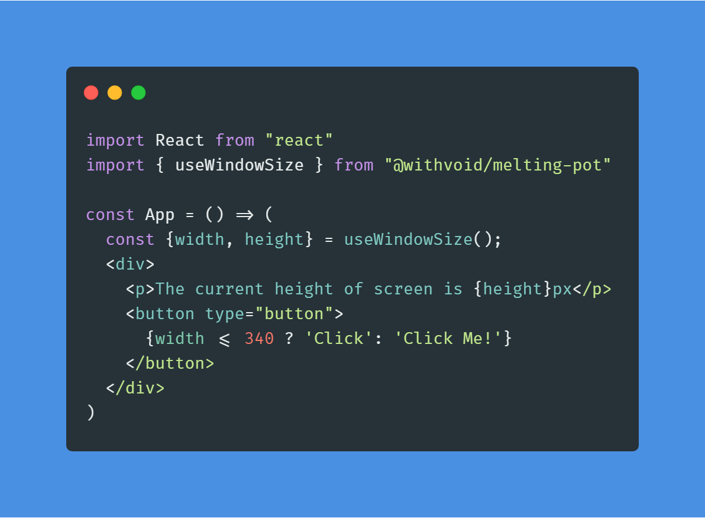

## Melting Pot

<p align="center">
  
  
  
</p>

The `@withvoid/melting-pot` package contains utilities, helper methods - your typical daily use functions (mostly in hooks).

## Demo

Hosted at 2 great platforms together.

* Netlify: [melting-pot.netlify.com](https://melting-pot.netlify.com)
* <strike>Zeits NOW: [melting-pot.now.sh](https://melting-pot.now.sh/)</strike> [Has issues, PR's are welcome]

## Getting Started

Install the package via npm or yarn:

```js
npm install @withvoid/melting-pot --save
```

Or if you prefer <b>yarn</b>

```js
yarn add @withvoid/melting-pot
```

Create your first application like so:

<div align="center">
  
</div>
